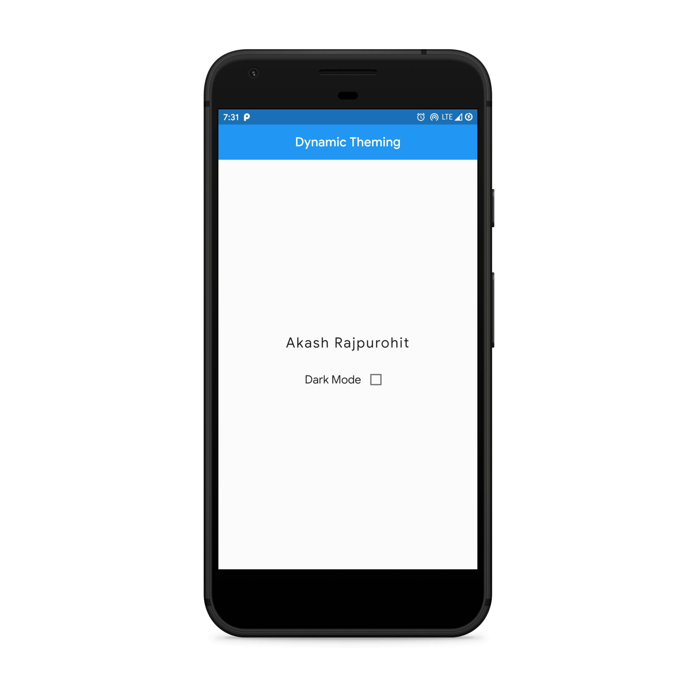
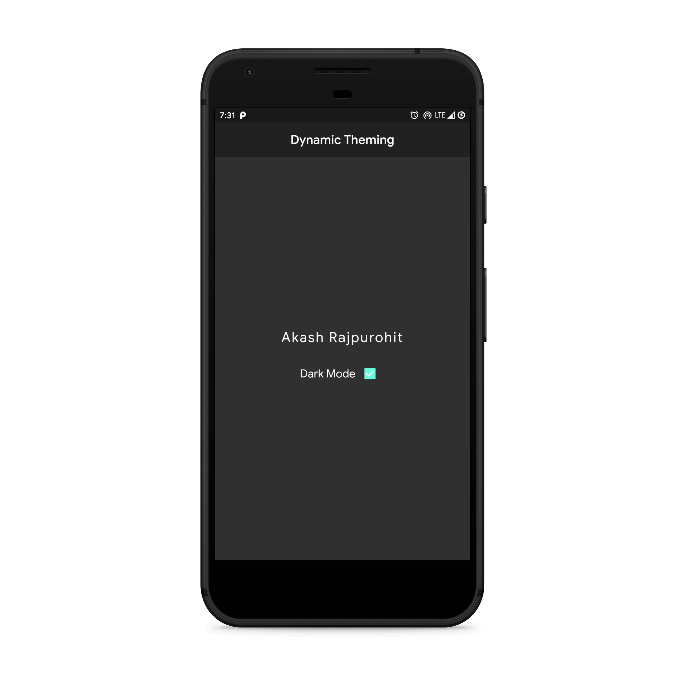

# Dynamic Theming in Flutter

Demo App on how to implement Dynamic Theming (Switch between dark and light mode) in Flutter using Provider.

# Screenshots

Light Mode                 | Dark Mode
:-------------------------:|:----------------------:
  | 

# Donate
> If you found this project helpful or you learned something from the source code and want to thank me, consider buying me a cup of :coffee::heart:

# Download
You can [download](https://github.com/AkashRajpurohit/Flutter-Dynamic-Theming/releases/download/v1.0.0/app-arm64-v8a-release.apk) the application for android and try it yourself.

# Bugs or Requests

If you encounter any problems feel free to open an [issue](https://github.com/AkashRajpurohit/Flutter-Dynamic-Theming/issues/new). Pull requests are also welcome.

## Visit My Portfolio
[Akash Rajpurohit](https://akashwho.codes)